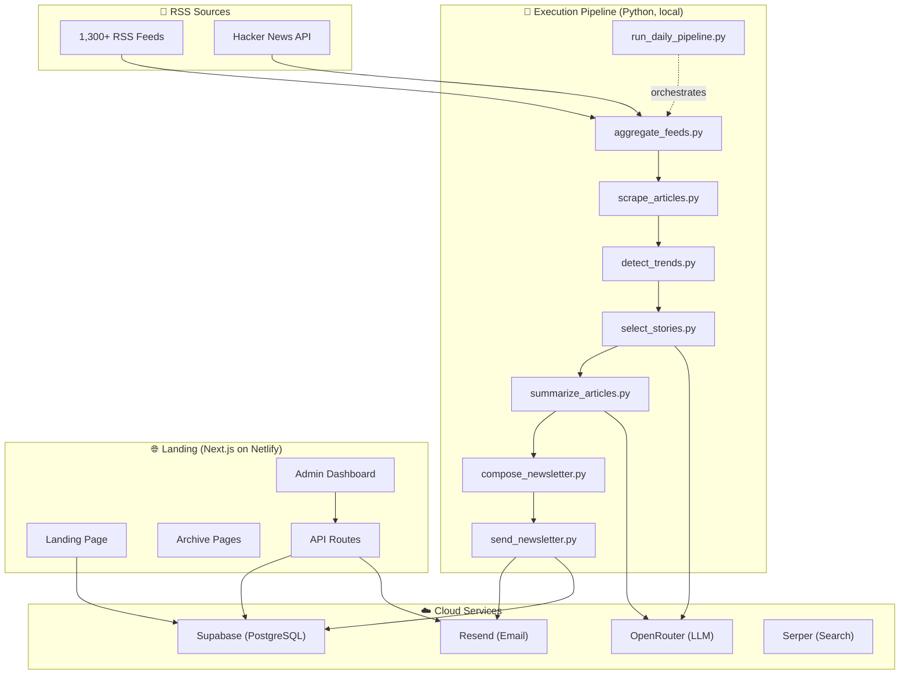
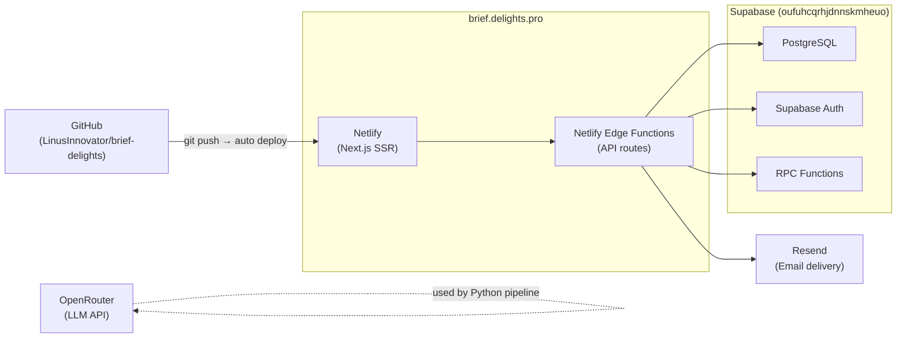
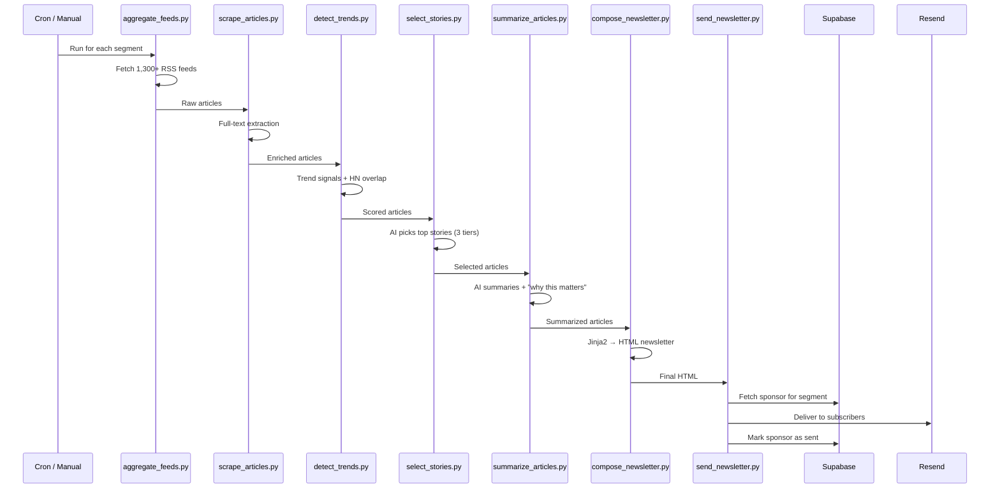

# Brief Delights — Architecture Guide

> **Live**: [brief.delights.pro](https://brief.delights.pro) · **Repo**: [LinusInnovator/brief-delights](https://github.com/LinusInnovator/brief-delights) · **DB**: [Supabase Dashboard](https://supabase.com/dashboard/project/oufuhcqrhjdnnskmheuo)

---

## System Overview



---

## Directory Structure

```
The letter/
├── .env                          # Python pipeline env vars
├── .github/                      # CI/CD workflows
├── netlify.toml                  # Netlify deployment config
├── newsletter_template.html      # Jinja2 daily newsletter template
├── segments_config.json          # 3 audience segments config
├── subscribers.json              # Local subscriber fallback
├── requirements.txt              # Python dependencies
│
├── execution/                    # 🐍 PYTHON PIPELINE
│   ├── run_daily_pipeline.py     # Orchestrator (runs all steps)
│   ├── aggregate_feeds.py        # Step 1: Fetch RSS feeds
│   ├── scrape_articles.py        # Step 2: Full-text scraping
│   ├── enrich_articles.py        # Step 3: Metadata enrichment
│   ├── detect_trends.py          # Step 4: Trend detection
│   ├── select_stories.py         # Step 5: AI story selection
│   ├── summarize_articles.py     # Step 6: AI summarization
│   ├── compose_newsletter.py     # Step 7: HTML composition
│   ├── send_newsletter.py        # Step 8: Email delivery
│   ├── hn_signals.py             # HN front-page signals
│   ├── prompt_templates.py       # LLM prompt library
│   ├── analyze_sources.py        # Source quality analysis
│   ├── synthesize_trends.py      # Cross-segment trends
│   ├── aggregate_weekly_trends.py
│   ├── synthesize_weekly_insights.py
│   ├── compose_insights_newsletter.py
│   ├── generate_weekly_charts.py
│   ├── automation_runner.py      # Cron-style automation runner
│   ├── utils/
│   │   ├── newsletter_archive.py # Archive helper
│   │   └── retry_helpers.py      # Retry/backoff utilities
│   └── automations/
│       ├── monetization/         # Sponsor discovery & outreach
│       │   ├── sponsor_matcher.py
│       │   ├── content_sponsor_discovery.py
│       │   ├── smart_pricing.py
│       │   ├── outreach_email_generator.py
│       │   ├── content_examples_generator.py
│       │   ├── proactive_placement.py
│       │   └── demo_outreach.py
│       ├── growth/               # Distribution automation
│       │   ├── reddit_bot.py
│       │   ├── twitter_bot.py
│       │   └── content_sharing_tools.py
│       └── analytics/
│
├── landing/                      # 🌐 NEXT.JS WEB APP
│   ├── .env.local                # Next.js env vars
│   ├── package.json
│   ├── next.config.ts
│   ├── middleware.ts             # Auth middleware
│   ├── lib/supabase/             # Supabase client
│   ├── components/
│   │   ├── ClientPage.tsx        # Landing page component
│   │   └── SignupForm.tsx        # Email signup form
│   ├── app/
│   │   ├── page.tsx              # Landing page (/)
│   │   ├── layout.tsx            # Root layout
│   │   ├── globals.css
│   │   ├── archive/              # Newsletter archive
│   │   │   ├── page.tsx          # Archive list (/archive)
│   │   │   └── [slug]/page.tsx   # Single issue (/archive/2026-02-16-builders)
│   │   ├── dashboard/page.tsx    # Subscriber dashboard
│   │   ├── auth/                 # Auth callbacks
│   │   ├── admin/
│   │   │   ├── login/page.tsx    # Admin login
│   │   │   ├── sponsors/         # Sponsor management (4 tabs)
│   │   │   │   ├── page.tsx      # Library, Schedule, Pipeline, Stats
│   │   │   │   ├── analytics/
│   │   │   │   ├── insights/
│   │   │   │   └── components/AdminNav.tsx
│   │   │   └── partnerships/page.tsx
│   │   └── api/
│   │       ├── subscribe/route.ts     # POST: new subscriber
│   │       ├── verify/route.ts        # GET: email verification
│   │       ├── track/route.ts         # GET: click tracking redirect
│   │       ├── dev-login/route.ts     # Dev auth bypass
│   │       ├── newsletters/[slug]/    # Newsletter content API
│   │       ├── webhooks/resend/       # Resend webhook handler
│   │       └── admin/
│   │           ├── sponsors/
│   │           │   ├── route.ts       # GET/POST sponsor leads
│   │           │   ├── [id]/send/     # Send outreach email
│   │           │   ├── content/       # CRUD sponsor creatives
│   │           │   ├── content/[id]/  # PUT/DELETE single creative
│   │           │   ├── schedule/      # Calendar assignments
│   │           │   ├── stats/         # Performance metrics
│   │           │   ├── analytics/     # Deep analytics
│   │           │   └── insights/      # AI insights
│   │           └── partnerships/
│   │               ├── route.ts       # CRUD partnerships
│   │               ├── [id]/          # Single partnership
│   │               └── generate-from-url/ # AI-generate from URL
│   ├── public/newsletters/       # Pre-rendered HTML archives
│   └── supabase/
│       └── migrations/           # SQL migration files
│
├── directives/                   # 📋 OPERATIONAL DOCS
│   ├── daily_automation.md       # Daily pipeline playbook
│   ├── aggregate_rss_feeds.md
│   ├── select_top_stories.md
│   ├── summarize_articles.md
│   ├── compose_newsletter.md
│   ├── send_newsletter.md
│   └── landing_admin.md
│
├── tools/                        # 🔧 UTILITIES
│   ├── deploy.sh                 # Deployment script
│   ├── verify_automation.sh      # Automation health check
│   ├── netlify_monitor.py        # Deployment monitoring
│   ├── import_subscribers.py     # Bulk subscriber import
│   ├── populate_sample_data.py   # Dev data seeding
│   └── apply_partnership_migration.py
│
├── feeds_config/                 # RSS feed lists
├── config/                       # Additional config
├── reports/                      # Generated reports
└── tests/
    └── test_sponsor_dashboard.py
```

---

## Production Infrastructure



| Service | Purpose | URL/Dashboard |
|---------|---------|---------------|
| **Netlify** | Hosting & SSR | [app.netlify.com/projects/briefdelight](https://app.netlify.com/projects/briefdelight) |
| **Supabase** | Database, Auth, RPC | [supabase.com/dashboard/project/oufuhcqrhjdnnskmheuo](https://supabase.com/dashboard/project/oufuhcqrhjdnnskmheuo) |
| **Resend** | Transactional email | [resend.com](https://resend.com) |
| **OpenRouter** | LLM gateway (GPT-4o, etc.) | [openrouter.ai](https://openrouter.ai) |
| **Serper** | Google search API | [serper.dev](https://serper.dev) |
| **GitHub** | Source control + CI trigger | [github.com/LinusInnovator/brief-delights](https://github.com/LinusInnovator/brief-delights) |

---

## Database Schema (Supabase)

6 migration files define the full schema:

| Table | Purpose | Migration |
|-------|---------|-----------|
| `subscribers` | Email subscribers with segment, status, referral | [Base schema](supabase-schema.sql) |
| `sponsor_leads` | Auto-discovered sponsor prospects | [20260211_sponsor_schema.sql](landing/supabase/migrations/20260211_sponsor_schema.sql) |
| `sponsor_content` | Ad creatives (headline, CTA, segments) | [20260216_sponsor_content_schema.sql](landing/supabase/migrations/20260216_sponsor_content_schema.sql) |
| `sponsor_schedule` | Date × segment calendar assignments | [20260216_sponsor_content_schema.sql](landing/supabase/migrations/20260216_sponsor_content_schema.sql) |
| `partnerships` | Partnership/collaboration tracking | [20260215_partnership_schema.sql](landing/supabase/migrations/20260215_partnership_schema.sql) |
| `referrals` | Subscriber referral tracking | [20260216_referral_schema.sql](landing/supabase/migrations/20260216_referral_schema.sql) |
| Analytics tables | Clicks, opens, engagement | [20260211_analytics_schema.sql](landing/supabase/migrations/20260211_analytics_schema.sql) |
| Proactive placement | Auto-matching sponsors to content | [20260211_proactive_placement_schema.sql](landing/supabase/migrations/20260211_proactive_placement_schema.sql) |

**Key RPC functions:**
- `get_sponsor_for_newsletter(date, segment)` → resolves scheduled or default sponsor
- `increment_sponsor_clicks(schedule_id)` → atomic click counter

---

## Audience Segments

Three parallel newsletter tracks, each with tailored content selection:

| Segment | Emoji | Focus | Target Audience |
|---------|-------|-------|-----------------|
| **Builders** 🔧 | 🔧 | Infrastructure, DevOps, APIs | CTOs, VPs of Engineering |
| **Leaders** 💼 | 💼 | Business strategy, M&A, market trends | CEOs, Founders |
| **Innovators** 🚀 | 🚀 | AI research, breakthroughs | Researchers, Early adopters |

Config: [segments_config.json](segments_config.json)

---

## Daily Pipeline Flow



**Orchestrator**: [run_daily_pipeline.py](execution/run_daily_pipeline.py) runs all steps sequentially for each segment.

**Article tiers** (per segment):
- **Full** — deep summary with "why this matters"
- **Quick Links** — one-line summaries
- **Trending** — hot topics across sources

---

## Environment Variables

### Python Pipeline (`.env`)

| Variable | Purpose |
|----------|---------|
| `SERPER_API_KEY` | Google search for sponsor discovery |
| `OPENROUTER_API_KEY` | LLM API (GPT-4o via OpenRouter) |
| `RESEND_API_KEY` | Email sending |
| `APIFY_API_TOKEN` | Web scraping (fallback) |
| `EMAIL_SENDER` | From address for newsletters |
| `SUPABASE_SERVICE_KEY` | Server-side DB access |

### Next.js App (`landing/.env.local`)

| Variable | Purpose |
|----------|---------|
| `RESEND_API_KEY` | Verification emails + outreach |
| `EMAIL_SENDER` | From address |
| `NEXT_PUBLIC_BASE_URL` | `https://brief.delights.pro` |
| `NEXT_PUBLIC_SUPABASE_URL` | Supabase project URL |
| `NEXT_PUBLIC_SUPABASE_ANON_KEY` | Client-side Supabase key |
| `SUPABASE_SERVICE_KEY` | Server-side Supabase key |

---

## Local Development

### Start the web app
```bash
cd landing
npm install
npm run dev
# → http://localhost:3000
```

### Run the daily pipeline
```bash
# Full pipeline for one segment
python3 execution/run_daily_pipeline.py --segment builders

# Individual steps
python3 execution/aggregate_feeds.py --segment builders
python3 execution/scrape_articles.py --segment builders
python3 execution/select_stories.py --segment builders
python3 execution/summarize_articles.py --segment builders
python3 execution/compose_newsletter.py --segment builders
python3 execution/send_newsletter.py --segment builders --dry-run
```

### Deploy
```bash
git add -A && git commit -m "..." && git push
# Netlify auto-deploys from main branch
```

### Apply Supabase migration
```bash
# Via Supabase dashboard SQL editor, or:
python3 tools/apply_partnership_migration.py
```

---

## Key Data Flows

### 1. Subscriber Signup
```
User → brief.delights.pro → /api/subscribe (POST)
  → Supabase: insert subscriber (status: pending)
  → Resend: send verification email
  → User clicks link → /api/verify (GET)
  → Supabase: update status → confirmed
```

### 2. Newsletter Delivery
```
Pipeline: compose_newsletter.py → .tmp/newsletter_{segment}_{date}.html
  → send_newsletter.py
  → Supabase: get_sponsor_for_newsletter(date, segment)
  → inject_sponsor() with tracking URL
  → Resend: send to each subscriber
  → Supabase: mark_sponsor_sent()
```

### 3. Click Tracking
```
Subscriber clicks article link in email
  → /api/track?url=...&segment=...&sponsor_schedule_id=...
  → If sponsor click: increment_sponsor_clicks() via Supabase RPC
  → 302 redirect to actual URL
```

### 4. Sponsor Management (Admin)
```
Admin UI → /admin/sponsors (4 tabs)
  Library:  /api/admin/sponsors/content (CRUD)
  Schedule: /api/admin/sponsors/schedule (calendar)
  Pipeline: /api/admin/sponsors (auto-discovery leads)
  Stats:    /api/admin/sponsors/stats (performance)
```
